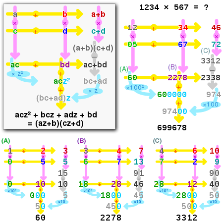

# Karatsuba multiplication (recursive)

If n is four or more, the three multiplications
in Karatsuba's basic step involve operands with fewer
than n digits. Therefore, those products can be computed by
recursive calls of the Karatsuba algorithm. The recursion
can be applied until the numbers are so small that they can
(or must) be computed directly.

In a computer with a full 32-bit by 32-bit multiplier,
for example, one could choose B = 231 = 2147483648,
and store each digit as a separate 32-bit binary word.
Then the sums x1 + x0 and y1 + y0 will not need an extra binary word
for storing the carry-over digit (as in carry-save adder),
and the Karatsuba recursion can be applied until the numbers to multiply are
only one-digit long.

## Personal
I read about this algorithm in the book by T. Rafgaarden.
He presented it in a recursive execution. What I noticed: in C ++,
the algorithm works with errors, but the reason is my lack
of understanding of this language since everything works fine on Python.